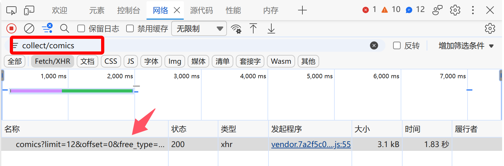
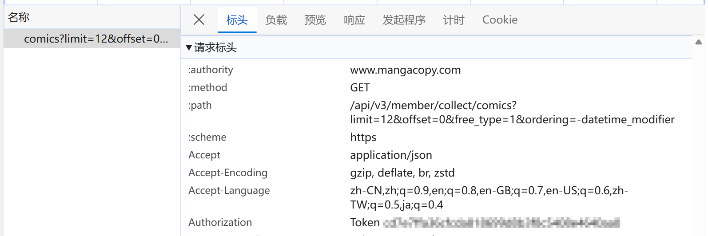

# copy2mihon

将拷贝漫画（CopyManga）的书架订阅和阅读历史导出为 Mihon / Tachiyomi 兼容的 `.tachibk` 备份文件。

## 功能特性

- **直接导出**：通过 Token 导出书架订阅与阅读历史，生成标准 `.tachibk` 备份文件。
- **备份合并**：支持将云端数据合并至手机已导出的 `.tachibk` 文件中，精准更新已读章节与历史时间戳，不破坏原有书架与其它图源数据。
- **多镜像站支持**：内置官方主站与多个可用镜像站，支持自定义域名输入与网络代理（HTTP/SOCKS5）。
- **确定性 Fallback**：针对缺失 `path_word` 的脏数据采用确定性 SHA-1 哈希算法，确保书架与历史多次导出/合并无缝对应，防止重复建书。
- **文本清洗与容错**：自动检测并修复 UTF-8 Latin-1 / CP1252 乱码文本，4xx 错误快速失败，网络抖动与 5xx 自动重试。
- **分类管理**：支持自定义书架分类、多分类标签映射或留空未分类。
- **离线转换**：支持将本地 JSON 格式的订阅数据转换为 `.tachibk`。
- **备份检查**：内置 `inspect` 命令查看 `.tachibk` 文件包含的漫画数、图源及分类信息。

---

## 🔑 如何获取拷贝漫画 Token

拷贝漫画 API 使用 Token 身份验证。获取步骤如下：

### 第一步：登录并进入个人书架页面
1. 打开浏览器登录拷贝漫画官网或镜像站；
2. **直接进入个人书架页面**：
   - 官方主站：`https://www.mangacopy.com/web/person/shujia`
   - 官方镜像 1：`https://www.copy4000.com/web/person/shujia`
   - 官方镜像 2：`https://2026copy.com/web/person/shujia`

> [!NOTE]
> 拷贝漫画在首页及阅读页禁用了 <kbd>F12</kbd> 和右键审查功能，**必须在个人书架页面（`/web/person/shujia`）中**才能正常调出开发者工具。

### 第二步：打开开发者工具抓包
1. 在书架页面按 <kbd>F12</kbd>（或右键选择 **检查 / Inspect**）打开浏览器开发者工具；
2. 切换到顶部的 **网络 (Network)** 标签页；
3. 在筛选搜索框中输入 `collect/comics`；
4. 刷新网页或点击书架分类，列表中会出现一条 `comics?limit=...` 的接口请求。



### 第三步：复制 Token
1. 点击该条请求，在右侧面板切换到 **标头 (Headers)** 选项卡；
2. 向下滚动找到 **请求标头 (Request Headers)** 中的 `authorization`；
3. 复制其后面的值（如 `Token cd7e7ffa36cf...` 或直接复制 40 位的字符即可）。



> **💡 提示**：
> - 工具会自动识别并去除 `Token ` 或 `Bearer ` 前缀与多余空格、引号。
> - 您也可以将 Token 设置到环境变量 `COPYMANGA_TOKEN` 中，无需每次在命令行重复输入。

---

## 快速使用

### 方式一：直接运行可执行程序（免安装 Python）
从 [Releases 页面](../../releases) 下载对应平台的单文件绿色程序（如 `copy2mihon-windows-amd64.exe`），双击即可启动交互式向导。

### 方式二：使用 uv / Python 运行
```bash
# 启动交互式引导向导
uv run copy2mihon
```

---

## 命令行使用

### 1. 合并到现有备份（推荐）

将云端数据注入手机已导出的备份文件中：

```bash
uv run copy2mihon merge --token "<YOUR_TOKEN>" -b backup.tachibk -o merged.tachibk -c "拷贝漫画"
```

指定自定义镜像域名：

```bash
uv run copy2mihon merge --token "<YOUR_TOKEN>" -b backup.tachibk -u "https://www.copy4000.com"
```

### 2. 导出完整备份（订阅 + 历史）

```bash
uv run copy2mihon export --token "<YOUR_TOKEN>" -o backup.tachibk
```

### 3. 仅导出书架订阅（不含历史记录）

```bash
uv run copy2mihon export --token "<YOUR_TOKEN>" --no-include-history -o backup.tachibk
```

### 4. 仅导出阅读历史

```bash
uv run copy2mihon export --token "<YOUR_TOKEN>" --history-only -o backup.tachibk
```

### 5. 转换本地 JSON 文件

```bash
uv run copy2mihon convert input.json -o output.tachibk -c "拷贝漫画"
```

### 6. 查看备份文件内容

```bash
uv run copy2mihon inspect backup.tachibk
```

---

## 参数说明

### `export` 参数

| 参数 | 说明 | 默认值 |
|---|---|---|
| `-t, --token` | 拷贝漫画 Token（可省略，回退到环境变量 `COPYMANGA_TOKEN` 或掩码输入） | - |
| `-o, --output` | 输出文件路径 | `copymanga_backup_YYYY-MM-DD_HH-MM.tachibk` |
| `-b, --existing-backup` | 待合并的现有备份路径 | 无 |
| `-c, --category` | 书架分类名称（传入 `none` 禁用分类） | `拷贝漫画` |
| `-u, --base-url, --url` | 拷贝漫画 API 地址或镜像站 | `https://www.mangacopy.com` |
| `--no-include-history` | 不导出阅读历史 | `False` |
| `--history-only` | 仅导出阅读历史 | `False` |
| `-s, --source-id` | 图源 ID | `6696312508930833206` |
| `--source-name` | 图源名称 | `拷贝漫画` |
| `--proxy` | HTTP / SOCKS 代理地址 | 无 |
| `--no-export-json` | 不同时生成 JSON 文件 | `False` |
| `--debug` | 启用调试模式并输出完整错误堆栈 | `False` |

### `merge` 参数

| 参数 | 说明 | 默认值 |
|---|---|---|
| `-t, --token` | 拷贝漫画 Token（可省略，回退到环境变量 `COPYMANGA_TOKEN` 或掩码输入） | - |
| `-b, --backup-file` | 现有的 `.tachibk` 文件路径（必填） | - |
| `-o, --output` | 输出文件路径 | `<原文件名>_merged.tachibk` |
| `-c, --category` | 分类名称（传入 `none` 禁用分类） | `拷贝漫画` |
| `-u, --base-url, --url` | 拷贝漫画 API 地址或镜像站 | `https://www.mangacopy.com` |
| `-s, --source-id` | 图源 ID | `6696312508930833206` |
| `--source-name` | 图源名称 | `拷贝漫画` |
| `--proxy` | HTTP / SOCKS 代理地址 | 无 |
| `--debug` | 启用调试模式并输出完整错误堆栈 | `False` |

### 环境变量

- `COPYMANGA_BASE_URL`：覆盖默认 API 基础地址（如设置为 `https://www.copy4000.com`）。
- `COPYMANGA_TOKEN`：提供拷贝漫画 Token，避免在命令行明文传入。
- `COPYMANGA_DEBUG`：设置为 `1` 时启用调试模式并输出完整错误堆栈（等同于 `--debug`）。

---

## 运行测试

```bash
uv run python -m pytest -v
```

## 打包为可执行文件 (.exe)

```bash
uv run python -m PyInstaller --onefile --name copy2mihon --clean main.py
```

打包完成后，可执行文件位于 `dist/copy2mihon.exe`，无需 Python 环境即可独立运行。

## License

MIT
